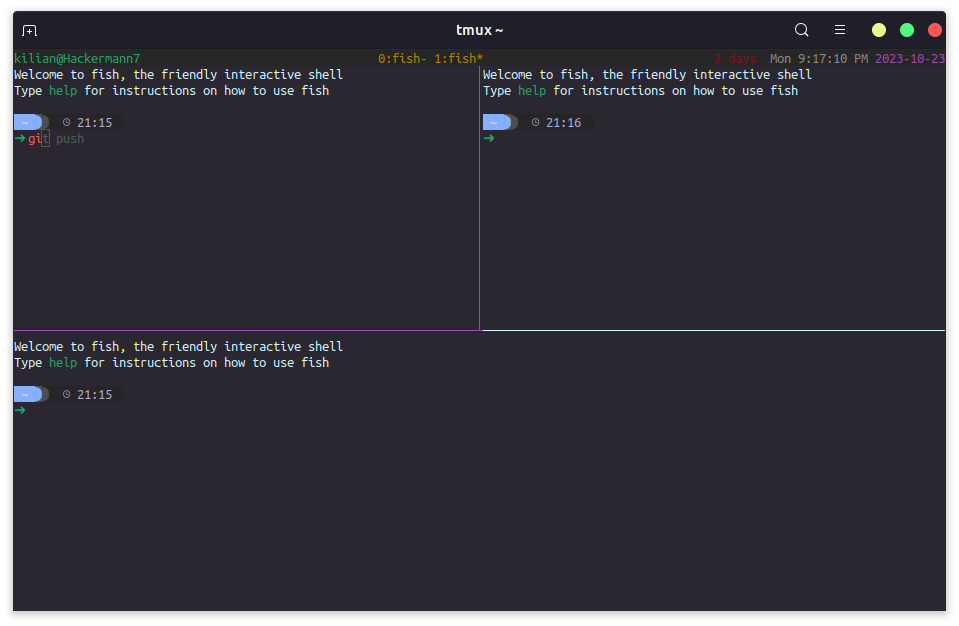

# terminal-configuration
A Place to Store my Terminal Configuration

At some point I might have the time to write a blog article about this...
## Setup
Shell: [fish](https://github.com/fish-shell/fish-shell)  
Prompt: [starship](https://github.com/starship/starship)  
Multiplexer: [tmux](https://github.com/tmux/tmux)  

## Screenshots
Trying to document the progress...
### 23 Oct 2023


## Use this Setup
Where to move files in order to use this configuration. Mostly a reminder for myself...
```
$ mv tmux.conf ~/.tmux.conf
$ mv starship.toml ~/.config/starship.toml
$ mv ./fish ~/.config
```

## ToDo
Things I want to improve
* Have a closer look at fish configuration
* Change something starship.toml
